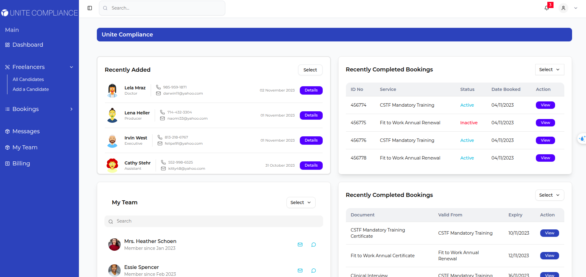
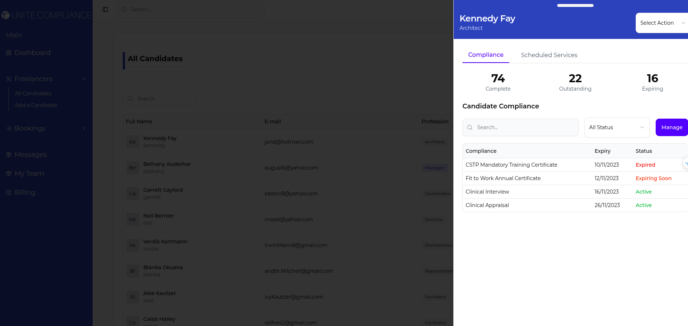
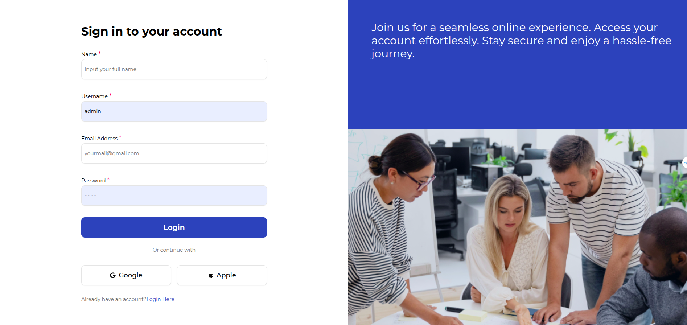
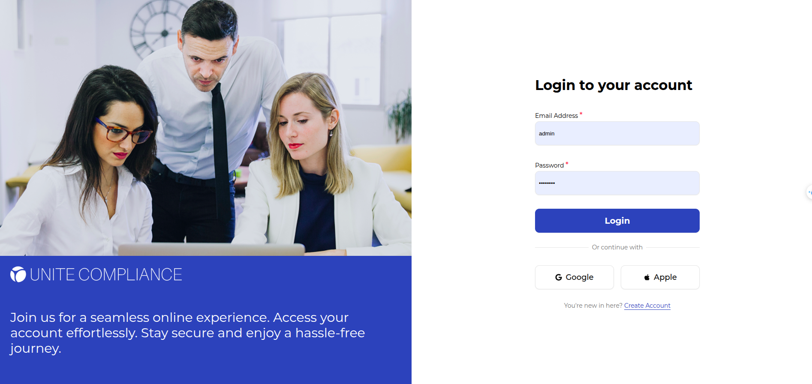

# HYBRBASE Technical Challenge: Client–Freelancer Portal

---

**Technical Challenge: Build a Client–Freelancer Portal with Payments & Project Visibility**

---

This challenge should take no more than **12 hours total** to complete.  
This open-ended technical assessment evaluates your ability to design a feasible solution and deliver a functional full-stack web application.  


--

## **Overview**

You’ll be developing a **secure portal** where two roles — **Clients** and **Freelancers** — can log in, view project information.  
The system must use:
- 🧭 [Next.js (latest version)](https://nextjs.org/) for the web application and routing  
- ⚙️ [Nest.js](https://nestjs.com/) for the backend API  

Keep the scope open-ended: you can choose **libraries, data models, and integrations** you believe best demonstrate your capabilities.

---

#  Frontend

> A modern full-stack frontend built with **Next.js 14**, **TypeScript**, and **TailwindCSS** — optimized for scalability, Dockerized for easy deployment.

---

##  Project Preview
<div align="center">
  
  
</div>

<div align="center">
  
  
</div>

---

## 🔗 Backend Repository
> The backend service for this project can be found here:  
> **[👉 Backend Repository Link](https://github.com/protam113/backend)**  

---

## 🧩 Project Structure

To explore the folder layout and file purposes, check [`tree.md`](./tree.md) located in the root directory.

---

## ⚙️ Setup Instructions

### 🧠 Prerequisites
- **Node.js** v18+
- **Yarn** (preferred over npm)
- Optional: **Docker & Docker Compose**

---

### 💻 Manual Setup

1. **Install dependencies**
   ```bash
   yarn install
````

2. **Start the development server**

   ```bash
   yarn dev
   ```

3. Or build and run the production version

   ```bash
   yarn build
   yarn start
   ```

4. Access the app at
   👉 [http://localhost:3000](http://localhost:3000)

---

### 🐳 Run with Docker

1. **Start containers**

   ```bash
   docker-compose up -d
   ```

2. **Open the app**
   👉 [http://localhost:3000](http://localhost:3000)

3. **Login credentials**

   ```
   username: admin
   password: Admin123
   ```

---

## 🧱 Tech Stack

* ⚛️ **Next.js 14 (App Router)**
* 🎨 **TailwindCSS** + PostCSS
* ⚡ **React Query (TanStack)** for server-state management
* 🧠 **Zustand** for global store
* 🧰 **Axios** for API calls
* 🐳 **Docker** for containerization
* 🧹 **ESLint + Prettier** for code style & quality

---

## 📂 Folder Highlights

| Folder            | Purpose                          |
| ----------------- | -------------------------------- |
| `/src/app`        | App routing and layout system    |
| `/src/components` | Reusable UI and logic blocks     |
| `/src/api`        | API abstraction with Axios       |
| `/src/store`      | Zustand global state             |
| `/src/hooks`      | Custom React hooks               |
| `/src/utils`      | Helper and validator functions   |
| `/src/configs`    | Configs (e.g. React Query setup) |
| `/public`         | Static assets and images         |

---

## 👨‍💻 Author

**Hoàng (Lenf)** — Full-stack Developer, Web App Enthusiast.

> “Build things that feel alive.”

